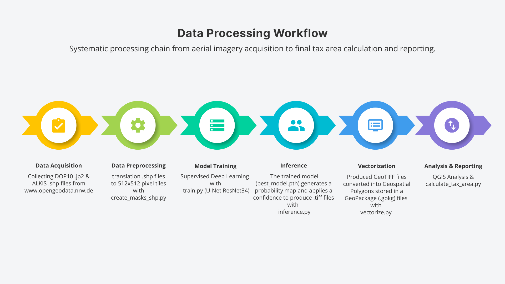
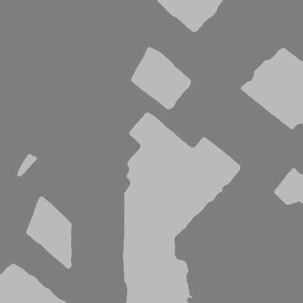

# Automated Urban Impervious Surface Extraction for Drainage Tax Assessment using Deep Residual U-Nets


> 📄 **[Read the Full White Paper (PDF)](./Automated_Urban_Impervious_Surface_Extraction.pdf)**

> **Note:** This repository contains the code and methodology for the research paper: *"Automated Urban Impervious Surface Extraction for Drainage Tax Assessment using Deep Residual U-Nets"*.

## Project Visuals
| **Macro-Scale Extraction** | **Pipeline Workflow** |
|:--------------------------:|:---------------------:|
|  |  |
| *Bonn Segmentation* | *End-to-End Processing Chain* |

## Project Overview
This project implements a deep learning framework to automate the detection of **Impervious Surfaces** (sealed areas like roofs, concrete, and asphalt) from high-resolution aerial imagery (DOP10). 

Municipalities in Germany levy a **Rainwater Drainage Tax** (*Niederschlagswassergebühr*) based on the sealed area of a property. Traditional assessment methods rely on manual digitization, which is costly and slow. This solution uses a **ResNet-34 encoded U-Net** to automate this process, enabling city-scale tax assessment in minutes rather than weeks.

## Objectives
* **Automation:** Replace manual digitizing of cadastral maps with AI-driven inference.
* **Precision:** Handle high-resolution (10cm GSD) orthophotos with complex urban geometries.
* **Fiscal Utility:** Convert pixel predictions into OGC-standard vector polygons for direct calculating of tax revenue (€).

## Methodology
1.  **Data Ingestion:** Fusing DOP10 Orthophotos (Raster) with ALKIS Cadastral Maps (Vector) from OpenGeodata NRW.
2.  **Preprocessing:** Custom rasterization bridge (`create_masks_shp.py`) to create binary training masks.
3.  **Architecture:** U-Net with a **ResNet-34** backbone (pre-trained on ImageNet).
4.  **Inference Strategy:** Sliding window inference with **Confidence Threshold Tuning** ($t=0.6$) to handle domain shifts.
5.  **Post-Processing:** Vectorization to GeoPackage (.gpkg) and spatial SQL analysis for area calculation.

## 🛠 Tech Stack
* **Deep Learning:** PyTorch, Segmentation Models PyTorch (SMP)
* **Geospatial:** Rasterio, Geopandas, Shapely, OpenCV
* **Hardware:** Trained on NVIDIA RTX 5070 (8GB VRAM) / AMD Ryzen 9 8940HX

## Results & Fiscal Impact
The model was validated on a $15 km^2$ region in Bonn, Germany.

| Metric | Value |
| :--- | :--- |
| **Intersection over Union (IoU)** | **0.8251** |
| **Pixel Accuracy** | **95.0%** |
| **Total Sealed Surface Detected** | **163,148 $m^2$** |
| **Est. Annual Tax Revenue** | **€ 138,676** |

## Engineering Challenges: The "Domain Shift"
A critical challenge arose during the transition from training on 8-bit PNG chips to inference on raw 16-bit JP2 satellite maps.

* **The Problem:** Initial inference produced a massive polygon covering the entire city. The model assigned Background pixels a probability of ~0.50 (Gray) instead of 0.0 (Black).
* **Root Cause:** Radiometric compression in the raw sensor data caused the background confidence to hover exactly at the standard decision boundary ($t=0.5$).
* **The Solution:** We implemented **Threshold Tuning**, raising the decision boundary to **0.6**. This mathematically filtered the background noise while retaining high-confidence building predictions ($p \approx 0.73$), as shown below:


*Left: Raw Output (Noise). Right: Corrected Output (Threshold t=0.6).*

## 📜 Citation
If you use this code or methodology in your research, please cite the project as follows:

**BibTeX:**
```bibtex
@misc{aslan2025impervious,
  author = {Aslan, Melih Levent},
  title = {Automated Urban Impervious Surface Extraction for Drainage Tax Assessment using Deep Residual U-Nets},
  year = {2025},
  publisher = {GitHub},
  journal = {GitHub Repository},
  howpublished = {\url{[https://github.com/YOUR_USERNAME/land-cover-classification-ai](https://github.com/YOUR_USERNAME/land-cover-classification-ai)}}
}